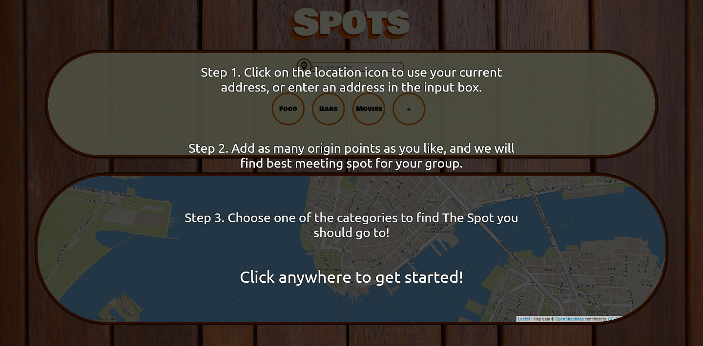
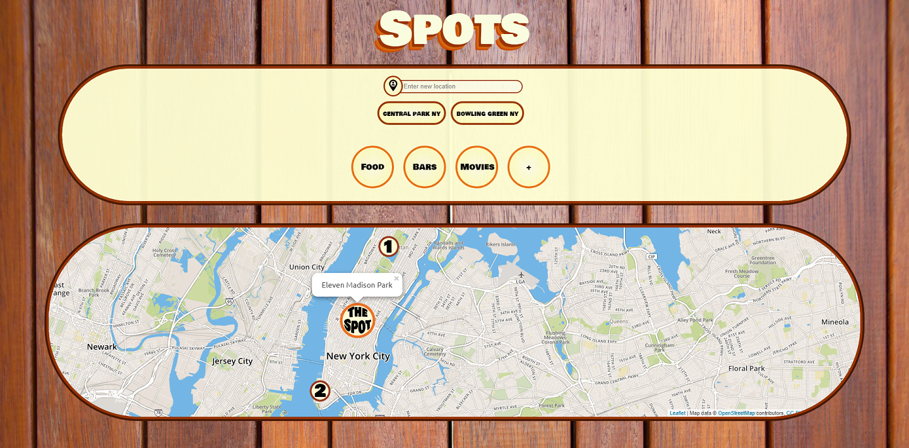
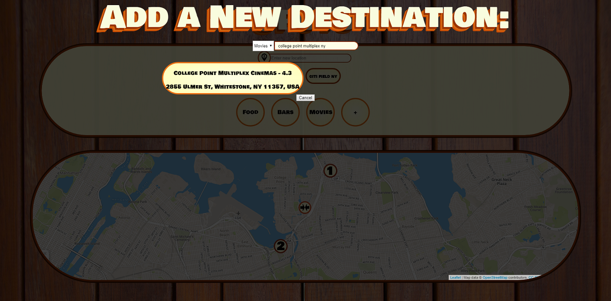
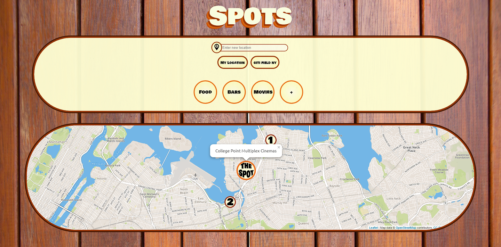

## Spots
Spots is an app that helps people meet up at a central location. Simply click to detect your current location, and/or enter addresses of your own/your friends'/other locations, then click a destination category. Spots will calculate the average point between your group and find the closest restaurant, bar or movie theatre. In addition, users can add new destinations to their own spots database, and the app's calculation will include the new ones. This is the front-end, it requires [Spots back-end](https://github.com/rainANDshine/spots-backend) to run.

## Technical Aspects
+ Integrated Mapbox API and Google API for displaying the map and address search
+ Created algorithm to find the average point between multiple geographic coordinates
+ Built back-end JSON API server with full CRUD functions with Ruby on Rails

## Latest Stable Branch
Master

## Installation
<code>git clone https://github.com/rainANDshine/spots</code>

<code>open index.html</code>

## Credits
Built by [Lane Miller](https://github.com/LaneMiller), [Jesse Horwitz](https://github.com/SuperJesseH), and [Shun Yao](https://github.com/rainANDshine)

## Screenshots

## License
MIT ©
